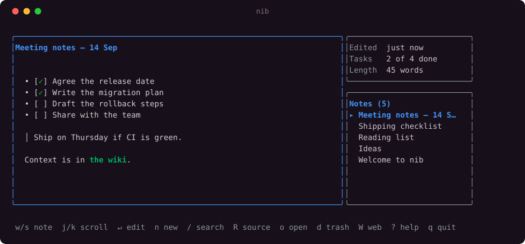

<div align="center">

# nib

**A Markdown note taker that lives in your terminal — and in your browser, from the same binary.**

Your notes are one SQLite file on your own disk. No account, no cloud, no sync service,
nothing running in the background.

[](https://github.com/Prathmeshgumal/nib/actions/workflows/ci.yml)
[](https://go.dev)
[](LICENSE)
[](#platforms)
[](https://github.com/Prathmeshgumal/nib/releases/latest)
[](https://nib-note.vercel.app)

**[nib-note.vercel.app](https://nib-note.vercel.app)**

</div>

<div align="center">
  
</div>

The note gets the screen. The right-hand column carries three facts about what you are
reading and the list of everything else.

Press `W` and the same notes open in a browser with a formatting toolbar and live
preview. Both stay open at once, backed by the same file.

---

## Contents

- [The idea](#the-idea)
- [Install](#install) · [Platforms](#platforms)
- [Starting it](#starting-it)
- [The terminal UI](#the-terminal-ui) — [moving](#moving-around) · [reading](#reading-a-long-note) · [aiming](#the-arrows-and-the-wheel-follow-your-last-click) · [copying](#copying-a-note) · [writing](#writing) · [lists](#lists-carry-on-by-themselves) · [search](#finding-notes) · [links](#links) · [images and files](#images-and-files) · [deleting](#deleting-and-undoing-it) · [the browser](#the-web-ui-from-the-terminal)
- [The web UI](#the-web-ui) — [files in the browser](#files-in-the-browser)
- [Writing notes](#writing-notes) — the Markdown it understands
- [Your notes on disk](#your-notes-on-disk)
- [The HTTP API](#the-http-api)
- [Why Go](#why-go) · [What it costs your machine](#what-it-costs-your-machine)
- [Working on the code](#working-on-the-code)

---

## The idea

Most note apps make you pick a side. Terminal tools are fast but ask you to give up a
readable, formatted view. Desktop apps are comfortable but ship a browser engine to draw
a text box, and want an account before you can write anything down.

`nib` is one 20 MB binary that gives you both views of the same SQLite file. It opens a
thousand notes and is ready in under 20 ms — less than Node takes to start an empty
script — holds about 28 MB of memory while you write, and leaves nothing running when
you quit.

---

## Install

Download it and run it. Nothing else to install — no Go, no Node, no runtime.

```bash
curl -L https://github.com/Prathmeshgumal/nib/releases/latest/download/nib-linux-amd64 -o nib
chmod +x nib
./nib
```

To keep it around, put it on your PATH:

```bash
mv nib ~/.local/bin/
```

On a 64-bit ARM machine — a Pi, an ARM server — use `nib-linux-arm64` instead.

<details>
<summary>Verifying the download</summary>

Every release ships a `checksums.txt`. Keep the original filename so the check can find
the file:

```bash
curl -LO https://github.com/Prathmeshgumal/nib/releases/latest/download/nib-linux-amd64
curl -LO https://github.com/Prathmeshgumal/nib/releases/latest/download/checksums.txt
sha256sum --ignore-missing -c checksums.txt
```

</details>

<details>
<summary>Building it yourself</summary>

You need [Go](https://go.dev/dl) and [Node](https://nodejs.org) to build, though neither is
needed to run the result.

```bash
git clone https://github.com/Prathmeshgumal/nib.git
cd nib
./build.sh
cp nib ~/.local/bin/
```

</details>

<details>
<summary><code>nib: command not found</code></summary>

`~/.local/bin` isn't on your PATH:

```bash
echo 'export PATH="$HOME/.local/bin:$PATH"' >> ~/.bashrc && source ~/.bashrc
```

</details>

The first run leaves you a welcome note to poke at. Delete it whenever you like — nothing
depends on it, and it is never written again.

<h3 id="platforms">Platforms</h3>

Releases are built for **Linux**, `amd64` and `arm64`, and that is where the app has been
developed and used.

The code has no platform-specific dependencies and cross-compiles cleanly for macOS and
Windows, but I have not run it there, so those builds are not published yet. If you want
one, build it yourself with `GOOS=darwin ./build.sh` — and tell me how it goes.

---

## Starting it

| Command | What it does |
| --- | --- |
| `nib` | Open the terminal UI |
| `nib --web` | Run only the web UI, no terminal interface |
| `nib --web --port 9000` | Same, on a port of your choosing (default 4321) |
| `nib --db /tmp/scratch.db` | Use a different database — handy for experimenting |
| `nib --version` | Print the version and exit |

`NIB_DB=/path/to.db nib` does the same as `--db`.

There are two interfaces over the same notes: the terminal UI (the default) and a web UI
you start when you want it. Both read and write the same SQLite file, and both can be
open at once.

---

## The terminal UI

The note you are reading fills the screen. Down the right-hand side sits a small box of
facts about it — when it was edited, how many tasks are done, how long it is — and under
that, the list of every other note. The bar along the bottom always shows the keys
available right now.

Notes are listed **most recently edited first**, so whatever you last worked on is at the
top. Saving a note moves it to the top, and your selection follows it rather than staying
at that position.

### Moving around

| Key | Does |
| --- | --- |
| `s` | Next note |
| `w` | Previous note |
| `g` / `G` | Jump to the first / last note |
| `r` | Reload from disk (picks up changes made in the web UI) |
| `?` | Full help — any key closes it |
| `q` | Quit |

### Reading a long note

The note pane scrolls, and shows a scrollbar when there is more than fits.

| Key | Does |
| --- | --- |
| `j` / `k` | Scroll one line, down / up |
| `space` / `b` | Scroll a page — `pgup` / `pgdn` do the same |
| `ctrl+d` / `ctrl+u` | Scroll half a page |
| `home` / `end` | Jump to the top / bottom |

### The arrows and the wheel follow your last click

Click a pane to aim at it. Click the note and `↑`/`↓` and the wheel scroll it; click the
list and they move between notes instead. The pane you aimed at wears the bright border,
so there is always something on screen saying which it is. Clicking a title opens it.

`w`/`s` and `j`/`k` ignore all of this — they always mean "another note" and "scroll this
one". Whatever the mouse has been doing, those four keys do one thing each.

**The cost of holding the mouse.** For the app to know where you clicked, the terminal
has to hand it the mouse, so **selecting text on this screen needs `shift` held down**
while you drag.

The app only holds it here, where there is something to aim at. The editor, the trash,
the help and `R` all give the mouse straight back, so selecting in those is normal. That
is not only about copying: while the app holds the mouse the terminal sends a burst of
escape codes for every scroll, and a fast scroll can overrun the parser and spill the
remainder as literal text — which in the editor would be typed into your note.

### Copying a note

| Key | Does |
| --- | --- |
| `R` | Show the Markdown source full-screen, to select with the mouse |

Press `R` and the note's Markdown fills the screen with no borders, no padding and no
scrollbar, so dragging over it selects the text and nothing else. Copy with your
terminal's own shortcut — **`Ctrl+Shift+C`** in GNOME Terminal and most Linux terminals,
`Cmd+C` on macOS. `esc` goes back.

You choose what to copy, which a key that copies the whole note cannot do, and it works
everywhere because it is your terminal doing the copying rather than the app asking for a
clipboard it may not be able to reach.

**`R` is also where the app gives the mouse back.** Everywhere else it holds the mouse so
it can tell which pane you clicked, and selecting text there means holding `shift` while
you drag. In this view there is nothing to click and everything to copy, so the mouse
returns to your terminal and no modifier is needed.

The other reason `R` exists is that the normal view draws borders around the text, and a
selection there would carry those along with it.

**Long lines wrap.** A line wider than the window is broken onto the next row so none of
it is hidden. Unlike your terminal's own wrapping, these breaks are real newlines, so a
selection copies them with it — worth knowing if you are copying a long paragraph back
into an editor that would rather have it as one line.

### Writing

| Key | Does |
| --- | --- |
| `n` | New note |
| `↵` | Edit the selected note |
| `e` | Edit the selected note straight in `$EDITOR` |

**It saves as you go,** about a second after you stop typing, the same as
[the browser does](#the-web-ui). You never have to remember `ctrl+s`, and closing the
terminal on a half-written note does not cost you it. The bottom bar says `saved` or
`unsaved` so you always know which.

Both ways out of the editor keep what you wrote, so neither can cost you anything: `esc`
and `ctrl+s` now do the same thing, and `esc` is no longer a way to throw work away by
reflex. To take an edit back, leave the editor and press `u`, or use the trash.

While editing:

| Key | Does |
| --- | --- |
| `ctrl+s` | Go back to the list |
| `esc` | Go back to the list |
| `tab` | Switch between the title field and the body |
| `ctrl+p` | Preview what you are writing; press again to go back |
| `ctrl+b` | Bold |
| `alt+i` | Italic |
| `alt+s` | Strikethrough |
| `alt+c` | Inline code |
| `alt+f` | Code block |
| `ctrl+k` | Link, cursor ready for the address |
| `alt+h` | Heading — press again for a deeper one |
| `alt+q` | Blockquote |
| `alt+l` | Bulleted list |
| `alt+o` | Ordered (numbered) list |
| `alt+t` | Task list |
| `alt+x` | Tick or untick the task under the cursor |
| `alt+r` | Horizontal rule |
| `ctrl+e` | Hand the body to `$EDITOR`; save and quit there to come back |
| `↵` | New line — inside a list it starts the next item |
| `alt+↵` | A plain line break, without continuing the list |

Notes are not limited in length. Paste a whole Markdown file in and keep editing it.

**Titles are optional.** Leave the title blank and the first line of the note becomes its
title, the way GitHub Gists work. If that first line is also the start of your note, the
preview shows it once — as the heading — not twice.

`$EDITOR` falls back to `$VISUAL`, then to nvim, vim, nano or vi, whichever is installed.

### Lists carry on by themselves

Press `↵` at the end of a list item and the next one starts for you — here only the words
were typed, never the `- [ ]`:

<div align="center">
  
</div>

| You have | `↵` gives you |
| --- | --- |
| `- [ ] buy milk` | `- [ ] ` |
| `- [x] buy milk` | `- [ ] ` — a new task starts unticked |
| `- buy milk` | `- ` |
| `1. first` | `2. ` — and keeps counting |
| `> a thought` | `> ` |

Indentation is kept, so a nested item stays nested.

**To finish a list**, press `↵` again on the empty item it just made: the marker is
removed and you are left on a plain line.

**For a line break inside an item**, use `alt+↵`. Shift+Enter would be the obvious
choice, but a terminal sends the very same byte for it as for Enter — they are literally
indistinguishable to any program running inside one.

`ctrl+b`, `alt+i`, `alt+s`, `alt+c` and `ctrl+k` act on the word under the cursor; the
rest act on the line. All of them toggle off if you press them again, and the list types
convert between each other rather than stacking.

Most are `alt+` because a terminal spends the control range on its own codes: **`ctrl+i`
is Tab**, `ctrl+h` is Backspace and `ctrl+m` is Enter — the same bytes, indistinguishable
to any program.

They are letters rather than digits because **terminals bind `alt+1`–`alt+9` to switching
tabs**, so a digit is swallowed before any program inside can see it. `alt+7` and `alt+8`
still work as aliases in terminals that do pass them through.

### Finding notes

| Key | Does |
| --- | --- |
| `/` | Start searching — the list narrows as you type |
| `↵` | Keep the filter and go back to the list |
| `esc` | Clear the search and show everything |

Search matches both titles and note bodies, and ignores case.

### Links

| Key | Does |
| --- | --- |
| `o` | Open something from this note — one thing opens, several offer a list |

Write links as `[some text](https://example.com)`. The preview shows only *some text* —
the URL stays hidden, like it would in a browser.

**Press `o` to open one.** If the note holds just one thing, it opens straight away. If
it holds several, a list comes up:

```
Open (3)
Opens in whichever app this desktop uses for it.

▸ 1 file System Design Interview by Alex Xu (1).pdf
  2 img  Screenshot From 2026-09-13 22-07-27.png
  3 link https://github.com
```

`↑`/`↓` to choose and `↵` to open, or press `1`–`9` to open a row outright. `esc` closes
it having opened nothing.

The preview emits real terminal hyperlinks (OSC 8), so link text and attached filenames
are genuinely clickable in GNOME Terminal, iTerm2, kitty, WezTerm and Windows Terminal.
But while the app is holding the mouse for click-to-focus, most terminals deliver a plain
click to the app instead of opening the link. Hold `ctrl` — `shift` in some terminals — to
click one, or use `o`, which always works.

URLs written out in full are clickable as well — they have no text to hide behind, so
they stay visible. Link syntax inside a code block stays literal.

### Images and files

**Drag a file onto the terminal while you are writing a note.** It gets attached.

That works because of what a terminal actually does with a dropped file: it has no
drag-and-drop of its own, so the emulator pastes the file's *path* as text. `nib` notices
a paste that names only files that exist, stores them, and writes a reference in place of
the path. A paste that is anything else — ordinary text, a URL, a path to something that
is not there — pastes exactly as it always has.

Drop several files at once and you get a line for each. Images are written as
`` and everything else as a plain link, so a PDF or a zip is just
as welcome as a screenshot.

**The preview names the file rather than drawing it.** An image appears as
`[img holiday.png]`. Terminals that can display pictures need the kitty, iTerm2 or sixel
protocol, and most terminals have none of them — so rather than guess, `nib` shows the
name and lets you open the real thing with `o`, in whatever viewer your system uses.

In the [web UI](#the-web-ui) you can drag a file straight onto the editor, or paste one:
a screenshot goes from `PrtSc` to `Ctrl+V` without ever becoming a file you have to name.
The browser also plays, shows and resizes what it can — see
[files in the browser](#files-in-the-browser).

Files are capped at **50 MB** each. Two notes using the same picture store it once —
every file is named after a hash of its own contents, so an identical file is recognised
as one you already have.

**Removing the line does not delete the file straight away.** It moves to a trash beside
your notes and is cleared after 30 days, the same as a deleted note. Put the line back
within the month — an undo, or restoring the note from the trash — and the file comes
back with it.

### Deleting, and undoing it

| Key | Does |
| --- | --- |
| `d` | Move the note to the trash — asks `y` / `n` first |
| `u` | Undo the last delete; press again to walk further back |
| `T` | Open the trash and restore anything in it |

Nothing is destroyed immediately. A trashed note stays recoverable for **30 days**, then
is purged the next time the app starts.

`u` walks back through your deletes one at a time, so several deletes take several undos.

`T` opens the trash:

| Key | Does |
| --- | --- |
| `w` / `s` | Move through the trashed notes |
| `↵` | Restore the selected note |
| `d` | Delete it for good — asks first, and cannot be undone |
| `E` | Empty the trash — asks first, and cannot be undone |
| `esc` | Back to your notes |

`d` and `E` are the only two actions in the app that destroy anything. Both name what
they are about to remove and both say plainly that it cannot be undone. A snapshot from
before the app started is still in `backups/` either way.

### The web UI from the terminal

| Key | Does |
| --- | --- |
| `W` | Start the web UI and open your browser |
| `W` again | Stop it |

While it's running, the status line shows the address.

---

## The web UI

Richer editing, at <http://localhost:4321>. Same notes, live at the same time as the
terminal — edit in one, press `r` in the terminal (or refresh the browser) to see it.

**There is no edit mode.** A note opens as one surface and typing into it is how it
changes — no Edit button to find, no Write/Preview tabs, no reading view to come back
to. What is on screen is the note: a heading looks like a heading while you write it, a
table is a table you can put the cursor in, and a code block has its own box. The
Markdown is still what lands on disk, so the terminal reads the same file it always did.

**Type `/` for anything you want to insert** — heading, list, task list, quote, code
block, table, divider, image. Select text and a small toolbar appears over it with bold,
italic, strikethrough, inline code and link. The usual shortcuts work as you would
expect: `Ctrl+B`, `Ctrl+I`, `Ctrl+K`, and Markdown itself is a shortcut — `# ` at the
start of a line makes a heading, `- ` a bullet, `- [ ] ` a task, ``` a code block.

**Lists carry on by themselves,** the same as [in the terminal](#lists-carry-on-by-themselves).
`Shift+↵` puts a line break inside an item, `Tab` and `Shift+Tab` indent and outdent, and
`Backspace` on an empty item clears the marker. Checkboxes are live — click one and it
ticks.

**Drag a file onto the note** and it is attached — or paste one, so a screenshot goes
from `PrtSc` to `Ctrl+V` without ever becoming a file you have to name and find again.
Images and video sit in the writing and can be dragged wider or narrower by the handle at
their edge; the width is remembered per file. See [images and files](#images-and-files)
for where they are kept, and [files in the browser](#files-in-the-browser) for what the
browser does with them.

**It saves as you go,** about a second after you stop typing and again when you leave the
note, so nothing is lost if you never press anything. `Ctrl+S` saves on demand. `Esc`
steps out of the writing and saves what is there — it does not throw anything away,
because on a surface with no edit mode there is no draft to discard. The badge by the
title reads Editing, Saving… or Saved so you can always tell which.

There's a search box, a light/dark toggle that follows your system by default, and
deleting asks for confirmation.

**The trash**, the same one the terminal shows. The bin at the foot of the sidebar
carries a count of what is recoverable and opens it: Restore on each note, a permanent
delete per note, and Empty trash. Deleting raises a message with an Undo button, and an
undo arrow sits beside the bin for as long as there is something to undo. Both permanent
actions ask first.

It is served from inside the binary and bound to `127.0.0.1`, so nothing else on your
network can reach it.

Everything the terminal can do, the browser can do too, and the other way around — the
only exceptions are the ones that only make sense in one place: `$EDITOR` hand-off and
`o` to open a link belong to the terminal, since a browser already clicks links itself.

### Files in the browser

A terminal can only name a file. A browser can open it, so here it does.

**Video and audio play where they sit.** A clip you attached to a paragraph gets a player
in that paragraph, with the filename underneath it — sending you to another tab to watch
something you dropped into a sentence would be a step backwards from a plain link. The
name under the player is also how you still get the file itself.

**Documents open in a tab of their own.** A `.docx` is converted and shown as text rather
than landing in your Downloads folder; `.csv` and `.tsv` are drawn as a table, and
`.md`, `.txt`, `.json`, `.yaml`, source files and the like are shown as they are. A PDF
goes to the browser's own viewer, which is better than anything worth building.

Nothing is uploaded anywhere to make that happen. The conversion runs in your browser,
reading the file from the same `127.0.0.1` the rest of the page comes from.

A format with nothing to show — a `.zip`, a `.pptx`, an `.mkv` the browser has no codec
for — still downloads on a click, as it always did.

**Drag the corner to resize.** Hover a picture or a video and a small grip appears at its
bottom-right; drag it and the media follows, down to a readable minimum and never wider
than the column. Double-click the grip to put it back to its natural size.

The width is remembered in your browser, not in the note. A screenshot you shrank stays
shrunk next time you open that note, while the Markdown on disk stays exactly what the
terminal wrote — so the note stays portable and the terminal preview stays clean. Because
every attachment is named after a hash of its contents, a file you have sized once is that
size in every note it appears in.

---

## Writing notes

GitHub-flavoured Markdown:

~~~markdown
# A heading

**bold**, *italic*, ~~strikethrough~~, `inline code`

- a bullet
- another
   - nested under it

1. numbered
2. lists

- [ ] a task
- [x] a finished task

> a quote

[link text](https://example.com)

| a | table |
| - | ----- |
| 1 | 2     |
~~~

Fenced code blocks work too, written with three backticks or three tildes.

A single newline is a line break, as in GitHub Gists — you don't need two. Both the
terminal and the browser treat it the same way.

**Tables need their separator row.** A header row alone isn't a table; the `|---|` line
under it is what makes one:

~~~markdown
| col1 | col2 | col3 |
| ---- | ---- | ---- |
| 10   | 20   | 30   |
~~~

**Task lists carry a bullet and a box**, `• [ ]` open and `• [✓]` done, the check in
green. This departs from GitHub, which hides the bullet and shows only the checkbox. The
brackets are ASCII because common monospace fonts do not carry `☐`/`☑`, and the
substituted glyph is drawn wider, which swallows the space after the box.

**Blank lines between groups of bullets are kept.** Markdown normally collapses them, so
the app restores the gap in the preview. Runs come out as 1, 3, 5, 7… lines: an odd
number of blank lines is exact, an even number lands one short. Numbered lists are left
alone, because splitting one would restart it at 1.

---

## Your notes on disk

```
~/.local/share/nib/nib.db          your notes, one SQLite file
~/.local/share/nib/attachments/    the files your notes refer to
~/.local/share/nib/backups/        automatic snapshots of the database, the last 10
```

Copy that directory and you have copied everything. The notes are one SQLite file; the
pictures and documents sit beside it, each named after a hash of its own contents.

**Snapshots happen on their own.** Every time `nib` starts, it copies the database into
`backups/` and keeps the most recent **10**. Attachments are not copied: a snapshot
exists to give you back an earlier version of something that changes, and an attachment
never changes — it is named after its own contents. What protects those is the 30-day
trash. To go back to a snapshot:

```bash
cp ~/.local/share/nib/backups/nib-20260913-140331.db \
   ~/.local/share/nib/nib.db
```

**Try things safely** on a throwaway database, without touching your real notes:

```bash
nib --db /tmp/scratch.db
```

Nothing leaves your machine. There is no account, no telemetry, and no network access
beyond the local page you start yourself.

---

## The HTTP API

Available whenever the web UI is running, for scripting against your notes.

| Method | Path | Does |
| --- | --- | --- |
| `GET` | `/api/health` | Check it's up |
| `GET` | `/api/notes` | List every note, newest first |
| `GET` | `/api/notes?q=term` | Search titles and bodies |
| `GET` | `/api/notes/:id` | Fetch one note |
| `POST` | `/api/notes` | Create — `{"title": "...", "content": "..."}` |
| `PUT` | `/api/notes/:id` | Update — same shape |
| `DELETE` | `/api/notes/:id` | Move to the trash |
| `GET` | `/api/trash` | List what is recoverable |
| `POST` | `/api/trash/:id` | Restore a note |
| `DELETE` | `/api/trash/:id` | Delete a note for good |
| `DELETE` | `/api/trash` | Empty the trash |
| `POST` | `/api/attachments` | Store a file — `multipart/form-data`, field `file` |
| `GET` | `/attachments/:name` | Fetch a stored file |

`title` may be omitted or empty; it's derived from the first line.

`POST /api/attachments` answers with the file's id, name, type, size, and the Markdown
line to put in a note — so a script never has to know how a reference is spelled:

```bash
curl -F file=@holiday.png localhost:4321/api/attachments
# {"id":"8f3a91c2d4e5f607","markdown":"",...}
```

Serving lives at `/attachments/`, not under `/api/`, because that is the path the
Markdown inside a note already spells.

The trash routes only act on trashed notes: a live note returns 404, so nothing can be
destroyed without being trashed first.

```bash
nib --web &
curl localhost:4321/api/notes
curl -X POST localhost:4321/api/notes \
  -H 'Content-Type: application/json' \
  -d '{"content": "# From the shell\n\n- [ ] it works"}'
```

---

## Why Go

The interesting constraint in a terminal app is **the gap between a keystroke and the
screen changing**. You notice 100 ms. You do not notice 1 ms. Everything else is
downstream of that.

Go compiles to a single static binary with no runtime to boot, and its garbage collector
is tuned for short pauses rather than peak throughput — which is exactly the trade a UI
wants. The practical effect is that startup is dominated by real work instead of by
loading an interpreter.

Measured in one sitting on one machine, every row the same way — wall clock around a
subprocess, median of 25 runs. The first four are what each runtime costs *before a line
of your code runs*:

| | Time |
| --- | --- |
| `/bin/true` — process creation floor | 0.8 ms |
| Python, empty script | 14.9 ms |
| Node, empty script | 24.3 ms |
| Node, after `require('react')` + `react-dom` | 49.7 ms |
| **`nib` — opened 1,000 notes and ready to serve** | **18.7 ms** |

The last row is not a floor. It is the whole job: opening the database, reading every
note, and standing up the server. It finishes before Node has finished starting up with
nothing in it at all.

**The honest version of this comparison:** Go is not magic, and a carefully written Rust
or C TUI would beat it. What Go buys is that the fast path is the default one — no bundler,
no runtime to install, no cold-start penalty — while staying a language you can read on a
Sunday. And the pure-Go SQLite driver means the binary has no cgo, no system libraries, and
cross-compiles cleanly.

---

## What it costs your machine

Measured on an Intel i5-13450HX running Ubuntu, with a **1,000-note** database.

| | |
| --- | --- |
| Binary | **19.8 MB**, static, stripped |
| Ready with 1,000 notes | **18.7 ms** median (18–20 ms) |
| Memory, terminal UI | **28 MB** resident |
| Memory, web server | **24.6 MB** idle, 28.5 MB under load |
| CPU while open and idle | **~1.4%** of one core |
| CPU after you quit | **none** — no daemon, no background process |
| Disk, 1,000 notes | **528 KB** (247 KB of that is the note text) |

And the operations you actually perform:

| | |
| --- | --- |
| Search across 1,000 notes | **4.6 ms** |
| List all 1,000 notes | **3.8 ms** |
| Write 1,000 notes over the API | **0.3 s** |
| Move the cursor (render a note) | **71 µs** |

The database is opened, not read into memory, so having a lot of notes costs you on
search rather than on startup — and searching a thousand of them still finishes inside a
single frame at 60 Hz.

These are real measurements, not estimates, but they are one machine on one afternoon:
an Intel i5-13450HX under Ubuntu, with everything in the page cache. Run them yourself
and you will get different absolute numbers — the ratios are the part that travels.

For scale on the memory number: the smallest Chrome renderer process running on this same
machine while I measured was 155 MB, and the largest was 405 MB.

The ~1.4% idle CPU is the terminal UI's render loop. It is not zero, and it is honest to
say so; quitting takes it to nothing at all, because there is nothing left running.

---

## Working on the code

```
main.go              flags, and wiring the three together
internal/store/      SQLite — the single source of truth for both interfaces
internal/tui/        the terminal UI, built on Bubble Tea
internal/web/        HTTP API, and the React bundle compiled into the binary
client/              React 18, Vite, Tailwind, shadcn/ui
```

One store, two front ends. The web bundle is embedded with `go:embed`, which is why the
browser UI needs nothing installed to serve it. SQLite runs in WAL mode, so the terminal
and the browser can both be open and see each other's writes.

```bash
./build.sh          # build the web bundle into the binary, compile ./nib
go test ./...       # store, terminal UI and HTTP behaviour
go vet ./...
```

Developing the web UI with hot reload, against a running API:

```bash
nib --web &
npm --prefix client run dev     # http://localhost:5173
```

Tests cover the store, the terminal UI's behaviour through its update loop, and the HTTP
API end to end. CI runs `gofmt`, `go vet` and `go test -race`, then builds the binary with
the same script you would.

---

## The site

**[nib-note.vercel.app](https://nib-note.vercel.app)** — the source is in
[`site/`](./site), one static HTML file with no build step. Look at it locally
with `python3 -m http.server -d site 8000`, publish it with
`npx vercel --cwd site --prod`.

## Contributing

Issues and pull requests are welcome. If you are changing behaviour, a test that fails
before your change and passes after it is the most useful thing you can bring.

## License

MIT — see [LICENSE](./LICENSE).
